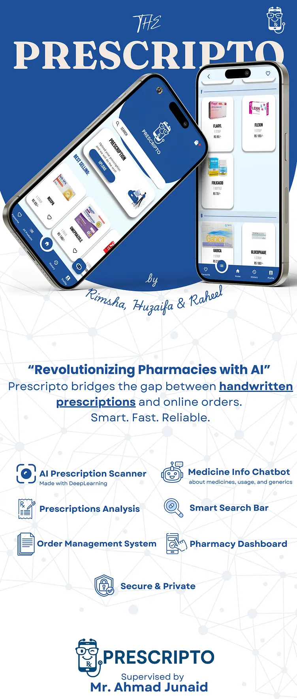

# Prescripto

Final Year Project — ranked **1st in the Software Engineering Department at CECOS University**  

**Prescripto** is an intelligent mobile application that streamlines medicine ordering and prescription interpretation for users and pharmacies. Built in Flutter and powered by applied AI, the app allows users to upload prescriptions, extract medicine names, and interact with a domain-specific chatbot for guidance on medicines, dosage, and general information.

---

## Features

### AI-Powered Prescription Classification
* Upload a prescription image and let the app automatically extract medicine names.
* Uses fine-tuned NLP models (ONNX) for high-accuracy classification.
* Reduces manual errors and speeds up order placement.

### Medicine Assistant Chatbot
* Ask questions about medicine usage, purpose, dosage guidelines, or precautions.
* Provides helpful, user-friendly responses based on curated medical information.
* *(Note: the chatbot does not provide medical diagnosis — only general information.)*

### Intuitive & Modern UI
* Clean, minimal, and easy-to-navigate interface.
* Smooth transitions and optimized layout for all screen sizes.
* Designed using UX best practices from Google UX Certification.

### Smart Medicine Ordering
* Extracted medicines can be added directly to the cart.
* Users can edit the list, customize quantities, and confirm orders.
* Seamless checkout experience.

### Secure User Authentication
* Safe login and signup process.
* Handles user identity, order history, and prescription records securely.

### Order Tracking
* Track order status from “Pending” to “Completed.”
* The pharmacy can update order progress in real-time.

### Prescription Upload History
* Stores previous prescriptions.
* Users can reorder frequently used medicines with one tap.

### MVVM Architecture with Provider
* Clean separation of UI, business logic, and data.
* Ensures maintainability and scalability of the project.

---

## Prescripto — Promo Video

Watch a short promo of the project below (GIF preview included; full video can be downloaded or linked):

<p align="center">
  
</p>

**Full video:** [Download / Watch Full Promo Video](assets/gif/prescripto_promo.mp4)

---

## Screenshots

<p align="center">
  
  
</p>

---

## Standee Poster

<p align="center">
  
</p>

---

## Tech Stack

| Category        | Tools / Technologies                              |
| --------------- | ------------------------------------------------- |
| Frontend        | Flutter, Dart                                     |
| Architecture    | MVVM + Provider                                   |
| AI / ML         | CRNN for handwriting recognition + NLP post-processing |
| Chatbot         | Domain-specific retrieval / LLM API              |
| Backend         | Firebase / Node.js / Django                       |
| Database        | Firebase Firestore / SQLite / API-based          |
| Authentication  | Firebase Auth / JWT                               |
| Version Control | Git & GitHub                                      |
| UI/UX           | Figma (Google UX-certified workflow)              |

---

## How It Works (High-Level Flow)

1. User logs in and uploads a prescription image.
2. Text is extracted → passed to the NLP model.
3. AI model extracts the medicine names.
4. User can ask the chatbot about each medicine:
   - Usage
   - Purpose
   - General dosage
   - Side effects / precautions
5. Medicines can be added to the cart.
6. User places the order → pharmacy updates status.
7. User tracks order status live.

---

## Installation

Clone the project:

```bash
git clone https://github.com/your-username/prescripto.git
